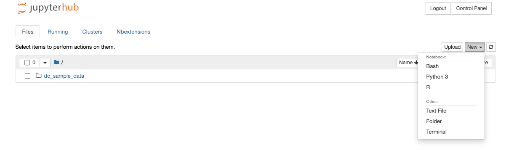
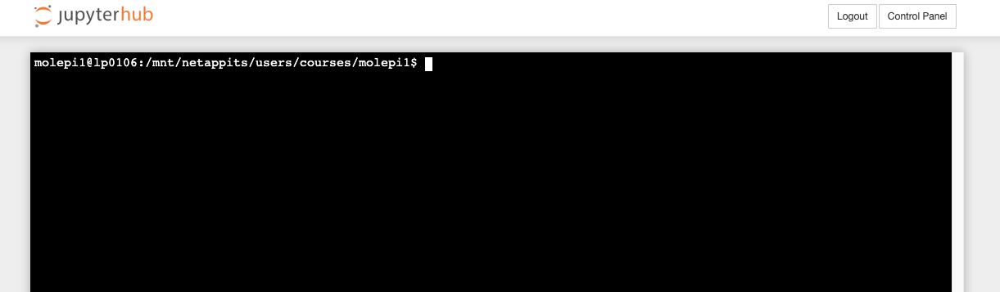

##  Logging into a Linux Server

To access the pre-configured workshop data, you'll need to use our log-in credentials (user name and password). A username will be assigned to you at the workshop. In the following, always replace molepi30 with your user name and the password with the password assigned to you.

**Log-in Credentials (case-sensitive!)**

- Username: molepi30
- Password: password

But first, you need a place to log *into*! To find the server that holds your data,
you'll need the host name of the server. Your instructor should have given this to you
at the beginning of the workshop.

A hostname is a label that is assigned to a device connected to a computer network and that is used to identify the server.

Go to the web-interface at the URL that is being indicated during the workshop. Fill in your username and password.

Click on 'New' on the right, and then on 'Terminal'

Now, a new terminal has started. The cursor should blink and await your input


